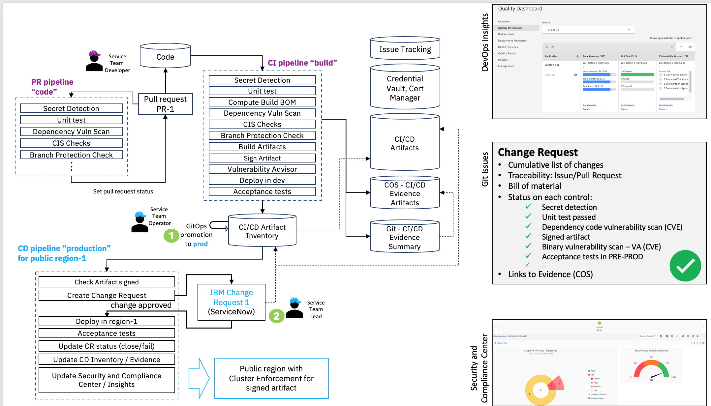

---

copyright:
  years: 2021
lastupdated: "2021-09-15"

keywords: DevSecOps, architecture, compliance, secure, CI, CD, IBM Cloud

subcollection: devsecops

---

{:shortdesc: .shortdesc}
{:table: .aria-labeledby="caption"}
{:external: target="_blank" .external}
{:codeblock: .codeblock}
{:pre: .pre}
{:screen: .screen}
{:tip: .tip}
{:note: .note}
{:important: .important}
{:download: .download}
{:help: data-hd-content-type='help'}
{:support: data-reuse='support'}

# DevSecOps architecture
{: #cd-devsecops-arch}

The {{site.data.keyword.contdelivery_full}} DevSecOps reference architecture can help to streamline compliance and audit-readiness.
{: shortdesc}

Because the continuous integration and continuous delivery processes are standardized, application development teams can be sure that they are following security best practices. The DevSecOps reference architecture provides a set of predefined continuous integration and continuous delivery toolchain templates. These templates use a collection of tool integrations and customizable reference Tekton pipelines for build, scan, test, change management, and deploy.

The Tekton pipelines provide a framework of custom scripts that you can use to ensure the compliant and automated orchestration of code and configuration changes. The pipelines can also help to maintain a GitOps release inventory, while it collects and stores evidence that can be used to generate auditable change requests.

You can use the pipelines to deploy to public cloud or hybrid target environments by using Tekton private pipeline workers. The Tekton pipelines run in predefined container images along with some user scripts. You can run anything that can be scripted, within boundaries of the Tekton pipelines.

## Shift-Left continuous integration and continuous delivery design
{: #cd-devsecops-design}

The following diagram shows the implementation workflow.

{: caption="Figure 1. Reference implementation workflow" caption-side="bottom"}

### Main features
{: #cd-devsecops-features}

* Pull or merge request validation uses a specific pull request pipeline that echoes status back to the pull request. This feature allows developers to find problems early in the development cycle.
* Integration is achieved by using a continuous integration pipeline that implements many controls out of the box and collects normalized evidence for these integrations in an evidence repository (repo). It also writes metadata on the artifacts to deploy into an artifacts inventory repo, which enables GitOps practices.
* Delivery is performed by using a continuous delivery pipeline to process content from the artifacts inventory and collect evidence to generate a change request for each deployment. It can also record compliance facts in the {{site.data.keyword.compliance_short}}, and these facts can be assessed against a compliance profile. 

As part of a continuous delivery staging deployment, continuous integration pipelines typically emit to the inventory master branch by using pull requests to promote the changes to a staging branch. Then, when ready, the changes are promoted again from staging to production with a subsequent branch promotion. 

To drive a coordinated release deployment, you can have multiple continuous delivery pipelines that output to a shared inventory and evidence repo. 

Only one change request is created when multiple artifacts in that inventory are promoted.
{: tip}

You can have multiple continuous delivery pipelines that pull from a shared inventory and evidence repo, which enables multiple environments to be targeted from the same continuous integration input.

## Reusable assets
{: #cd-devsecops-reusable-assets}

The DevSecOps reference implementation is composed of the following building blocks:

* **CLI**: A command-line interface to help manage evidence collection, change requests, and inventory updates. 
* **Script library**: A library of useful scripts that drive compliance checks. 
* **Tekton task library**: Reusable Tekton tasks that can be aggregated into custom pipelines. These tasks in particular are used by the reference pipelines.
* **Toolchain template for continuous integration with Tekton**: A template for quickly provisioning a complete continuous integration solution. The template uses Tekton pipelines and integrates with various tools, such as Git repos, secrets storage, image registry, code scans, and object storage.
* **Toolchain template for continuous delivery with Tekton**:  A template for quickly provisioning a complete continuous delivery solution. The template uses Tekton pipelines and integrates with various tools and the [{{site.data.keyword.compliance_full}}](https://www.ibm.com/cloud/security-and-compliance-center){: external}. Tools might include Git repos, secrets storage, image registry, and a change management system.

## Learning resources
{: #cd-devsecops-learning-resources}

There a number of useful enablement resources available to help you evaluate and adopt the continuous integration and continuous delivery templates. You might choose to start with the [Deploy a secure app with DevSecOps best practices](/docs/devsecops?topic=devsecops-tutorial-cd-devsecops) tutorial, which takes you through various common continuous integration and continuous delivery paths.

Other useful learning aids are available here:

* [Getting started with {{site.data.keyword.contdelivery_full}}](/docs/ContinuousDelivery?topic=ContinuousDelivery-getting-started)
* [Installing {{site.data.keyword.deliverypipeline}} private workers](/docs/ContinuousDelivery?topic=ContinuousDelivery-install-private-workers)
* [Working with Tekton pipelines](/docs/ContinuousDelivery?topic=ContinuousDelivery-tekton-pipelines)
* [Getting started with the {{site.data.keyword.cloud}} Command Line Interface (CLI)](/docs/cli?topic=cli-getting-started)
* [Continuous Deployment to Kubernetes](/docs/solution-tutorials?topic=solution-tutorials-continuous-deployment-to-kubernetes)
* [Getting started with {{site.data.keyword.containerlong}}](/docs/containers?topic=containers-getting-started)
* [Toolchain availability, templates, and tutorials](/docs/ContinuousDelivery?topic=ContinuousDelivery-cd_about)
