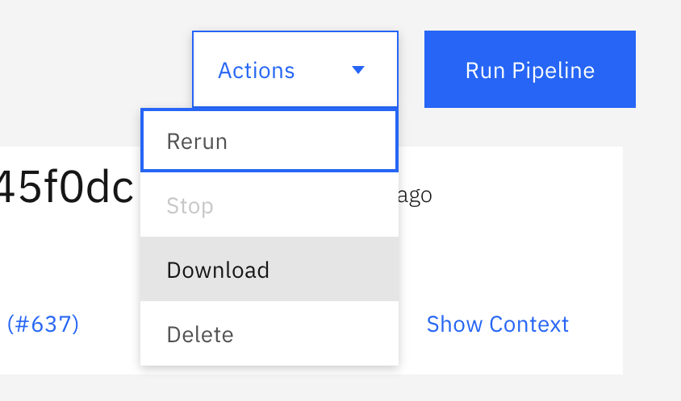
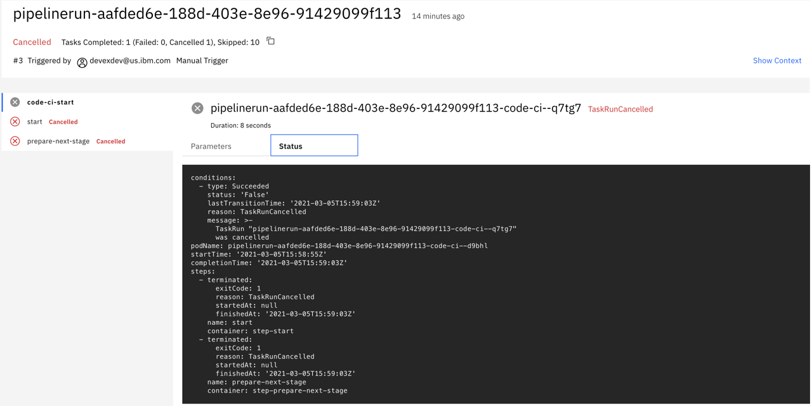

---

copyright:
  years: 2021
lastupdated: "2021-10-13"

keywords: troubleshoot, DevSecOps

subcollection: devsecops

---

{:tsSymptoms: .tsSymptoms}
{:tsCauses: .tsCauses}
{:tsResolve: .tsResolve}
{:external: target="_blank" .external}
{:shortdesc: .shortdesc}
{:screen: .screen}
{:codeblock: .codeblock}
{:pre: .pre}
{:note:.deprecated}
{:tip: .tip}
{:important: .important}
{:troubleshoot: data-hd-content-type='troubleshoot'}
{:support: data-reuse='support'}

# Troubleshooting for DevSecOps
{: #troubleshoot-devsecops}

## General troubleshooting methods
{: #troubleshoot-general}
{: troubleshoot}
{: support}

* Reload the page in case the UI is slow or the logs fail to load.
* Check for outages on the [status page](https://cloud.ibm.com/status){: external}
* Run the pipeline again.

   

## Issues related to the IBM environment
{: #troubleshoot-ibm-env}
{: troubleshoot}
{: support}

### The check-registry step of the containerize task fails with error.


{{site.data.keyword.cloud_notm}} registry offers a limited quota, pushing too many images it can be exceeded.

Go to images, delete some and rerun the pipeline.
You can check your quota limits and usage by issuing ibmcloud cr quota command.

### Logs do not show for step.


This is an issue with the tekton environment.

Try reloading the page.
Download the logs using the download button.



## Issues related to template and pipeline
{: #troubleshoot-template-pipeline}
{: troubleshoot}
{: support}

### Task is cancelled because base image cannot be accessed.



Check if your artifactory credentials are correct. A new artifactory token can be created here.
You can create a secret manually by running:

```bash
kubectl create secret docker-registry mysecret \
--dry-run \
--docker-server=wcp-compliance-automation-team-docker-local.artifactory.swg-devops.com  \
--docker-username=<username> \
--docker-password=<artifactory token> \
--docker-email=<email> \
-o yaml
```

It will output something similar:

```bash
apiVersion: v1
data:
  .dockerconfigjson: <your secret>
kind: Secret
metadata:
  creationTimestamp: null
  name: regcred
type: kubernetes.io/dockerconfigjson
```

In the pipeline properties, update the `artifactory-dockerconfigjson` parameter with the .dockerconfigjson value.


For more information, check out the [kubectl documentation on creating a secret](https://kubernetes.io/docs/concepts/configuration/secret/)(: external).

## Image signing issues
{: #troubleshoot-signing}
{: troubleshoot}
{: support}

If your image signing tasks fails, refer to the [image signing documentation](/docs/devsecops?topic=devsecops-cd-devsecops-image-signing) to verify that the signing key was correctly generated and stored.

## Troubleshooting {{site.data.keyword.contdelivery_short}}
{: #troubleshoot-cd-related}

For more general issues related to the {{site.data.keyword.contdelivery_short}} service, see the {{site.data.keyword.deliverypipeline}} [troubleshooting page](/docs/ContinuousDelivery?topic=ContinuousDelivery-troubleshoot_delivery_pipeline).

## Getting help from the community
{: #troubleshoot-devsecops-community}

Not finding your answer, solution? Get help fast directly from the {{site.data.keyword.cloud_notm}} development teams and other users.

The DevSecOps team actively monitors our Slack channel for questions about the DevSecOps, {{site.data.keyword.contdelivery_short}} services, and toolchains.

[](https://ic-devops-slack-invite.us-south.devops.cloud.ibm.com/){: external}
